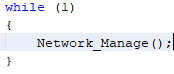

<!-- Please do not change this html logo with link -->

# TCP/IP Lite Stack + ENC28J60 Examples

This repository provides MPLAB X IDE projects that can work out of the box. The code examples that are included in the repository include functionality for DHCP, UDP, TCP Server and TCP Client Demos. If the user wants to create the project from scratch, please use the below instructions to get started. The app_files folder may be copied into the project to build the projects. Note that the TCP/IP Lite stack needs to be serviced every 1 second and the timer callback function needs to be set to 1 second.

---

## Related Documentation

More details can be found at the following links:
- [Microchip Ethernet Controllers](https://www.microchip.com/design-centers/ethernet/ethernet-devices/products/ethernet-controllers)
- [ENC28J60](https://www.microchip.com/wwwproducts/en/en022889)
- [TCP/IP Lite Stack](https://www.microchip.com/wwwAppNotes/AppNotes.aspx?appnote=en573940)
- [Curiosity HPC Board](https://www.microchip.com/developmenttools/ProductDetails/dm164136)

## Software Used

- MPLAB® X IDE 5.40 or newer [(microchip.com/mplab/mplab-x-ide)](http://www.microchip.com/mplab/mplab-x-ide)
- MPLAB® XC8 2.20 or a newer compiler [(microchip.com/mplab/compilers)](http://www.microchip.com/mplab/compilers)
- MPLAB® Code Configurator (MCC) 4.0.1 or newer [(microchip.com/mplab/mplab-code-configurator)](https://www.microchip.com/mplab/mplab-code-configurator)
- MPLAB® Code Configurator (MCC) Device Libraries PIC10 / PIC12 / PIC16 / PIC18 MCUs [(pic10-pic12-pic16-pic18-1.81.6.mc3lib)](http://ww1.microchip.com/downloads/en/DeviceDoc/pic10-pic12-pic16-pic18-1.81.6.mc3lib)
- MPLAB® Code Configurator (MCC) Application Libraries TCP/IP Lite Stack [(tcpipLiteStack-2.2.13.mc3lib)](http://ww1.microchip.com/downloads/en/DeviceDoc/tcpipLiteStack-2.2.13.mc3lib)

## Hardware Used

- Curiosity High Pin Count (HPC) Development Board [(dm164136)](https://www.microchip.com/developmenttools/ProductDetails/dm164136)
- ETH Click by MikroE [(ETH Click)](https://www.mikroe.com/eth-click)
- [PIC18F26K42](https://www.microchip.com/wwwproducts/en/PIC18F26K42)

## Setup

To install the MPLAB® Code Configurator Plugin:
1. In MPLAB X IDE, select Plugins from the Tools menu.
2. Select the Available Plugins tab.
3. Check the box for the MPLAB® Code Configurator v3, and click on Install.

---

To install the TCP/IP Lite Stack Library:
1. Open the MPLAB Code Configurator page: [https://www.microchip.com/mcc](https://www.microchip.com/mplab/mplab-code-configurator)
2. Scroll to the bottom of the page and select the Current Downloads tabs.
3. Download the TCP/IP Lite Stack Application Library [(tcpipLiteStack-2.2.13.mc3lib)](http://ww1.microchip.com/downloads/en/DeviceDoc/tcpipLiteStack-2.2.13.mc3lib).
4. In the MPLAB® X IDE click on Tools → Options.
     - This may also be found under: In the MPLAB® X IDE click on MPLAB® X IDE → Preferences.
5. Click on Plugins tab.
6. Click on Install Library.
7. Browse to the location where you saved tcpipLiteStack-2.2.13.mc3lib, select and click Open.

---

## DHCP Example

1. Open the MPLAB X IDE v5.40.
 
2. Create a new standalone project. This project uses the device PIC18F26K42 and XC8 compiler (v2.20).
3. Launch the MCC plugin using the MCC icon in the top right corner in MPLAB X IDE. Alternatively, MCC can also be launched by selecting Tools-> Embedded-> MPLAB Code Configurator v3: Open/ Close.
 
4.	In Project Resources tab, select System Module. 
    - Go to Registers view, in RSTOSC, choose “HFINTOSC with HFFRQ = 64 MHz and CDIV = 1:1” from the dropdown menu.
 
    - Go to easy setup view and update HF Internal Clock to 8MHz.
 
5.	Go to the Libraries listed in the Device Resources tab. Double click on TCP/IP Lite Library to load the module.
 
6. In Project Resources tab, select TCP/IP Lite module. This will display all the protocols supported by the TCP/IP Lite stack.
    - UDP, DHCP and ICMP Protocols must be checked.
    - IPV4 & ARP are always required and are checked by default.
 
7.	In Project Resources tab, select MAC module. Select the “ENC28J60” Ethernet device. The default MAC address is “02: 00: 00: 00: 00: 01”.
 
8.	Go to the Pin Manager: Grid View tab. Click on the following pins for their configuration:
 
 
9.	Go to Pin Module under Project Resources. Set the custom names for the pins as shown in the table in the MPLAB Code Configurator tab.
 
10.	In Project Resources tab, select TMR1 module. Configure the system time to 1 second by doing the following:
    - Update the Clock Source to “FOSC/4”.
    - Update the Timer Period to “25 ms”.
    - Check the “Enable Timer Interrupt”
    - Update the Callback Function Rate to “40” times.
 This results the timer configuration to interrupt for every 1 second.
 
11.	Click on Generate to generate the code for configured modules.
 Note: Click on Generate even if MPLAB X shows a warning. These warnings are handled later by modifying the code. Close the Merge [MCC] tab which automatically opens on clicking Generate. Click on Yes if MPLAB X asks a Question to close the Merge [MCC] tab.
 
12.	In main.c, enable global interrupts.
 
13.	In the generated code, in main.c add Network_Manage() in the while(1) loop. This is required to handle the packets in the network.
 
14.	Launch Wireshark. From the Capture menu, click Options.
Select an Interface from the list to which your board and PC are connected, click Start for capturing packets.
 e.g.: Local Area Network
15.	In Wireshark, set the filter field as bootp||arp||icmp.
 
16.	Click Clean and Build Project. After successful build, click on Program Device to program the code to the device.
17.	In Wireshark, notice the DHCP packets handshake to get the device IP address.
 
18.	In Wireshark, double click on “Offer” packet. Expand “Dynamic Host Configuration Protocol” to get the device IP address.
 
19.	On your PC, open the Command Prompt (cmd.exe) window and ping the device using its IP address with the command:
 ping 192.168.0.37
 

---

## UDP Example

1. Follow all steps from DHCP Example.
2. Under Header Files/app_files, right click and Add Existing Item. Select udp_demo.h.
3. Under Source Files/app_files, right click and Add Existing Item. Select udp_demo.c.
 
4.	Open Windows Command Prompt application on your PC. Type “ipconfig” to get the IP address of your PC.
 
5.	In main.c, add the following code:
 
    - Add the header include for udp_demo: 
 
    #include "app_files/udp_demo.h"
 
    - Add the initialization function for UDP before the while(1) loop:
 
    UDP_DEMO_Initialize();
 
    - Add inside the while(1) loop add code for UDP Send function:
 
 
6.	Sending UDP Packets: In udp_demo.c, under the function UDP_DEMO_Send ():
 
    - Modify the Destination IP address with PC’s IP address as noted in Step 4.
 
    - Destination Port (anything in the range of dynamic ports)
 
 
7.	Receiving UDP Packets: In Source Files\MCC generated files\ udpv4_port_handler_table.c, add the following code:
 
    - Include the udp_demo.h file in the list of include files:
 
    #include "../../app_files/udp_demo.h"
 
    - In UDP_CallBackTable, add the following code to perform UDP Receive:
 
 
8.	Click Clean and Build Project. After successful build, click on Program Device to program the code to the device.
 
9.	Open the Java application TCPIP_Demo.exe. Go to the UDP tab and assign the same port number as ‘DestPort’(65531). Click on ‘Listen’ button. Click “Allow Access” if warning occurs. Assign the IP Address of your board which is found from step 19 of DHCP example(192.168.0.37). Click on ‘Claim’ button.
 
 
10.	Launch Wireshark. From the Capture menu, click Options.
Select an Interface from the list to which your board and PC are connected, click Start for capturing packets.
 e.g.: Local Area Network
 
11.	In Wireshark, set the filter field as bootp||udp.port==65531.
 
12.	In Demo GUI, click on LED 1, 2, 3, 4 to light the LEDs D1, D2, D3, D4, respectively and observe the Wireshark capture. 
 
 
13.	In Demo GUI, type data(e.g.: “Hello World”) inside Send Data box and press the Send button and observe the Wireshark capture.
 
 
14.	On the Curiosity HPC Board, press the Switch S1 and observe the Wireshark capture.
 

---

## TCP Client Example

1.	Follow all steps from DHCP Example.
2.	Select TCP/IP Lite from project resources and check the TCP box as shown below:
 
3.	Under Header Files/app_files, right click and Add Existing Item. Select tcp_client_demo.h.
4.	Under Source Files/app_files, right click and Add Existing Item. Select tcp_client_demo.c.
 
5.	In main.c, add the following code:
 
    - Include the tcp_client_demo.h file in the list of include files: 
 
    #include "app_files/tcp_client_demo.h"
 
    - Add the header include for ip_database for finding IP address:
 
    #include "mcc_generated_files/TCPIPLibrary/ip_database.h"
 
    - Declare variable for ip before System_Initialize:
 
    unsigned long ip;
 
    - Add inside the while(1) loop add code for TCP Client function:
 
6.	Modify the server IP address with PC's IP address in tcp_client_demo.c under function call TCP_Client_Initialize:
 
7.	Click Clean and Build Project. After successful build, click on Program Device to program the code to the device.
8.	Open the Java application TCPIP_Demo.exe. Go to the TCP Server Demo tab and assign the port number as ‘65534’. Click on ‘Listen’ button. The status of the TCP Connection is printed inside the STATUS text box.
 
 
Also in Wireshark, observe the TCP packets by setting the filter “tcp.port == 65534”.
 
9.	After the connection is established:
 
    - Type text inside the Send text box and click on ‘Send’ button. The text sent is displayed inside the Sent/Received Data box.
 
 
Also in Wireshark, observe the TCP packets by setting the filter “tcp.port == 65534”
 
 
    - Click on the Led buttons {0, 1, 2, 3, 4}. This will toggle LEDs on board.
 
 
Also in Wireshark, observe the TCP packets by setting the filter “tcp.port == 65534”
 
10. Push ‘Disconnect’ button, to close the TCP Connection. A client disconnected message will appear on the STATUS text box.  

---

## TCP Server Example

1.	Follow all steps from DHCP Example.
2.	Select TCP/IP Lite from project resources and check the TCP box as shown below:
 
3.	Under Header Files/app_files, right click and Add Existing Item. Select tcp_server_demo.h.
4.	Under Source Files/app_files, right click and Add Existing Item. Select tcp_server_demo.c.
 
5.	In main.c, add the following code:
 
    - Include the tcp_server_demo.h file in the list of include files:  
 
    #include "app_files/tcp_server_demo.h"
 
    - Add the header include for getting IP address:
 
    #include "mcc_generated_files/TCPIPLibrary/ip_database.h"
 
    - Declare variable for ip before system_initialize:
 
    unsigned long ip;
 
    - Add inside the while(1) loop add code for TCP Server function:
 
6.	Click Clean and Build Project. After successful build, click on Program Device to program the code to the device.
7.	Open the Java application TCPIP_Demo.exe. Go to the TCP Client Demo tab, assign the board IP address as Server IP address in the GUI. Assign the port number as ‘7’. Click on ‘Connect’ button. The status of the TCP Connection is printed inside the STATUS text box.
 
8.	After the connection is established:
 
    - Type text inside the Send text box and click on ‘Send’ button. The text sent is echoed and displayed inside the Sent/Received Data box.
 
 
    - Also in Wireshark, observe the TCP packets by setting the filter “tcp.port == 7”
 
 
9.	Push ‘Disconnect’ button, to close the TCP Connection. TCP server closing the connection message will appear on the STATUS text box.

---